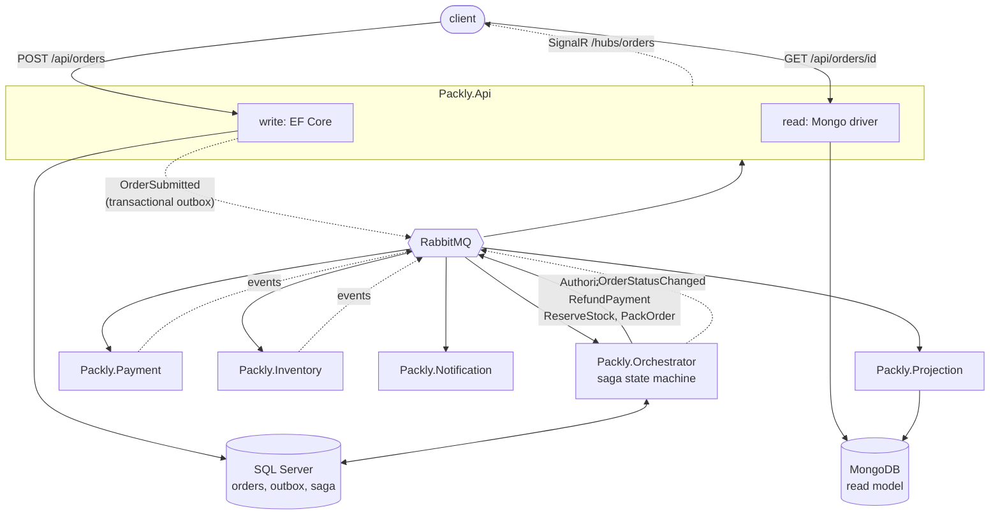
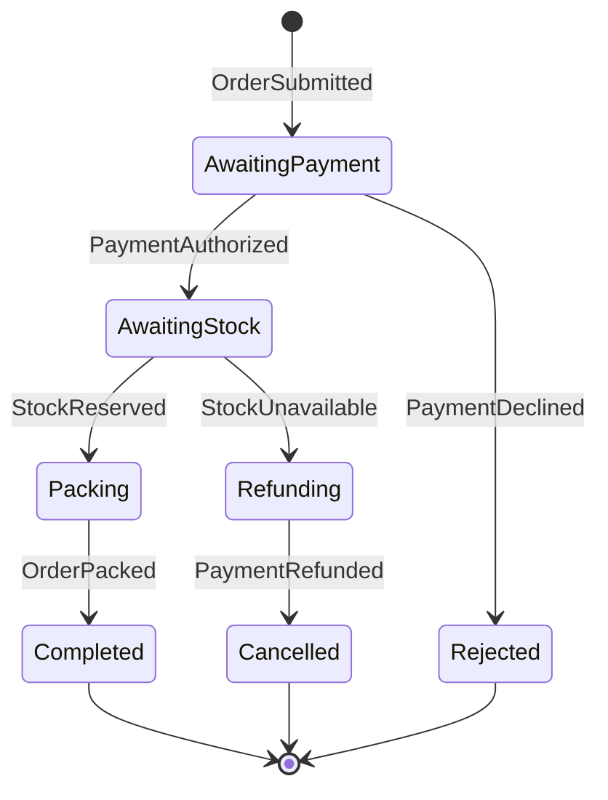

# Packly

[](https://github.com/HMalyhon/Packly/actions/workflows/ci.yml)

Event-driven order processing with CQRS. An order is placed over HTTP, a saga
decides what happens to it, and four independent services do the work and react
to the results — none of them knowing the sequence they sit in.

Six .NET services, four backing services, one command to run the lot:

```bash
docker compose up --build
```

Then open <http://localhost:8080>, place an order, and watch it move. Swagger is
at <http://localhost:8080/swagger>, the broker's own UI at
<http://localhost:15672> (`packly` / `packly`), and the traces at
<http://localhost:16686>.

---

## What it is

A deliberately small e-commerce flow, built to show the shape of an event-driven
system rather than the depth of a domain. Placing an order returns immediately;
everything after that happens on other services, in their own time, and the
customer learns about it through status events.



The page is the shortest way to see all of it at once: submit an order and the
statuses arrive as each service reports in, pushed over SignalR rather than
polled. The three buttons pick the happy path, a declined payment and a stock
failure.

Commands are **sent** to a named queue, because exactly one service can carry
them out. Events are **published**, because the publisher has no business knowing
who cares. That distinction is the whole reason `Packly.Notification`, `Packly.Projection`
and the API's SignalR bridge could each be added — and can be removed — without
the orchestrator changing at all. Three subscribers, one event, no publisher
that knows who is listening.

## The saga

The orchestrator is the only service that decides what happens next, and the only
publisher of `OrderStatusChanged`. Every other service knows how to do its own
work and nothing about where that work falls in the sequence.



`Rejected` and `Cancelled` are different endings. Nothing was ever authorised for
a rejected order, so there is nothing to undo. A cancelled one got as far as an
authorisation and then failed on stock, so the money has to be released before
the order can be called off — and the customer is told nothing until it has been,
because announcing a cancellation before the reversal would be a promise the
compensation had not yet kept.

That compensating branch is why this is a saga and not a distributed
transaction. The authorisation was committed in another service, several messages
ago, and nothing can roll it back; it is undone by a second ordinary business
operation, and the state machine is what remembers one is owed.

## Try it

The page at <http://localhost:8080> does all of this: pick a preset, place the
order, watch it move. The same thing over HTTP, for the curious — both failure
paths are deterministic, so you can trigger either on demand rather than waiting
for one.

**Happy path** — reaches `Completed`:

```bash
curl -X POST http://localhost:8080/api/orders -H 'content-type: application/json' -d '{
  "customerId": "ada",
  "items": [{ "sku": "MUG-1", "name": "Mug", "quantity": 2, "unitPrice": 4.50 }]
}'
```

**Payment declined** — the rule is on the order **total**, not on any one price,
so two chairs at 600 are refused where one at 600 would not be. Ends at
`Rejected`:

```bash
curl -X POST http://localhost:8080/api/orders -H 'content-type: application/json' -d '{
  "customerId": "ada",
  "items": [{ "sku": "CHAIR-1", "name": "Chair", "quantity": 2, "unitPrice": 600.00 }]
}'
```

**Stock failure and refund** — any SKU starting **`SOLD-OUT`** authorises payment,
fails on stock, refunds, and ends at `Cancelled`:

```bash
curl -X POST http://localhost:8080/api/orders -H 'content-type: application/json' -d '{
  "customerId": "ada",
  "items": [{ "sku": "SOLD-OUT-1", "name": "Rare Vinyl", "quantity": 1, "unitPrice": 42.00 }]
}'
```

Each returns an order id. Follow one — these read MongoDB, never SQL Server:

```bash
curl http://localhost:8080/api/orders/ORDER_ID
curl 'http://localhost:8080/api/orders?status=Cancelled&pageSize=5'
```

Or watch it happen:

```bash
docker compose logs -f notification     # simulated emails, on outcomes only
docker compose logs -f orchestrator     # every saga transition
```

### Seeing the split for yourself

```bash
# write model: normalised, and no status column anywhere
docker exec packly-sqlserver /opt/mssql-tools18/bin/sqlcmd \
  -S localhost -U sa -P 'Packly!Local1' -C -d PacklyOrders -Q "SELECT * FROM Orders"

# read model: denormalised, status and full history in one document
docker exec packly-mongo mongosh -u packly -p packly --authenticationDatabase admin \
  PacklyRead --quiet --eval "db.order_status.find().pretty()"
```

Stop SQL Server and the queries keep answering while submission fails — the two
sides share nothing but events:

```bash
docker compose stop sqlserver

# reads: still answered, from MongoDB
curl -s -o /dev/null -w '%{http_code}\n' http://localhost:8080/api/orders/ORDER_ID  # 200
curl -s -o /dev/null -w '%{http_code}\n' 'http://localhost:8080/api/orders'         # 200

# writes: 500, because that is the side that is down. Takes ~15s: Entity
# Framework retries a connection failure before giving up.
curl -s -o /dev/null -w '%{http_code}\n' -X POST http://localhost:8080/api/orders \
  -H 'content-type: application/json' \
  -d '{"customerId":"ada","items":[{"sku":"MUG-1","name":"Mug","quantity":1,"unitPrice":4.50}]}'

# health: 503, and `docker compose ps` marks the API unhealthy. It names each
# check - write model, read model, broker - so the answer says which one is down
# rather than only that something is.
curl -s http://localhost:8080/health

docker compose start sqlserver
```

### Durability

Stop a worker, submit an order while it is down, then start it again. The order
picks up where it left off: the command waited in a durable queue and the saga
waited in SQL Server.

```bash
docker compose stop payment
# submit an order - accepted, and it stops at AwaitingPayment
docker compose start payment
# a few seconds later it is Completed
```

The same holds for the broker itself. Stop RabbitMQ, submit an order, and the API
still answers 202: the event is staged in the outbox table alongside the order
row and delivered once the broker returns.

### Following one order across the services

Every service reports what it did to Jaeger, at <http://localhost:16686>. Pick
`packly-api`, open the newest trace, and the whole order is one waterfall rooted
at `POST /api/orders`.

Nothing correlates them after the fact: MassTransit carries the trace context in
the message headers, so the pieces stitch themselves. A completed order comes to
about seventy-five spans across six services, and three claims made above are
visible in it rather than asserted:

- **The fan-out.** Every `OrderStatusChanged` forks into three sibling spans -
  the projection, the notification worker and the API's SignalR bridge - none of
  which the orchestrator knows exist.
- **The outbox.** Each publish is an `outbox send` and then an `outbox process`:
  the message staged in the database first and handed to the broker afterwards,
  rather than going straight out.
- **Where the time goes.** Packing dominates at roughly two seconds, payment and
  reservation sit under one, and every step that is not a simulated delay is
  single-digit milliseconds.

It is also the fastest way to find a stuck order: the trace shows whether a
command was sent and never consumed, or consumed and never answered.

Traces are held in memory, so they last as long as the container.

## Tests

```bash
dotnet test
```

The saga is the part worth testing and the part hardest to check by hand: the
three ways an order can end, and the duplicate that must not end it. Five tests
run against an in-memory bus and saga repository rather than RabbitMQ and SQL
Server — what is under test is the decision, which command follows which event
and where the order lands, and that is the same whichever transport carries it.
No containers, a few seconds.

## Layout

| Project | Role |
| --- | --- |
| `Packly.Api` | Accepts orders into SQL Server, answers queries from MongoDB, pushes status to browsers |
| `Packly.Orchestrator` | Owns the saga; the only publisher of `OrderStatusChanged` |
| `Packly.Payment` | Authorises and refunds |
| `Packly.Inventory` | Reserves stock and packs |
| `Packly.Notification` | "Emails" the customer on outcomes |
| `Packly.Projection` | Builds the read model |
| `Packly.Contracts` | Message schemas, and nothing else: no transport, no serializer |
| `Packly.Messaging` | Broker connection and trace export, shared by every service |
| `Packly.ReadModel` | Read model schema and the serialisation it assumes |

The three shared assemblies are all contracts — what services say to each other,
how they reach the broker and report what they did, and what shape the read model
has. No shared domain
logic, and no shared write-side persistence.

## Decisions worth explaining

**Transactional outbox on the write side.** `POST /api/orders` publishes
`OrderSubmitted` through the same `DbContext` as the order row, so the two commit
together or not at all. Publishing straight to the broker would leave two ways to
be wrong: an order nobody hears about if the broker is down, or an event for an
order that was rolled back. Stop RabbitMQ and submit an order — you still get a
202, and the message drains when the broker comes back.

**Inbox on the saga.** The orchestrator deduplicates redeliveries against an
`InboxState` table, so at-least-once delivery cannot drive the same transition
twice.

**An in-memory outbox on the two workers that publish.** A different thing
entirely: it holds what a consumer publishes until the consumer returns
successfully, so a retried attempt cannot leave an event behind from the attempt
that failed. Order matters — it is configured *inside* the retry, because an
outbox wrapping the retry spans every attempt and flushes the failed one's
publishes along with the good one's. The notification and projection services
publish nothing, so neither needs one.

**Optimistic concurrency via `rowversion`, not `ISagaVersion`.** MassTransit's
Entity Framework repository ignores `ISagaVersion` — only the document-database
repositories honour it — so a plain counter would produce a concurrency check
that always passes. SQL Server stamps the column itself, and the losing write
retries instead of overwriting the winner.

**The projection is idempotent by version.** Every status change carries a
monotonic version, and the current status moves only when a newer one arrives.
Delivery is at-least-once and unordered, so without that an order could be shown
moving from `Completed` back to `Packing`.

The history is a separate decision, and conflating the two cost it three entries
out of five. A step that arrives late still happened, so it is recorded whether or
not it wins that comparison — always written, deduplicated by version rather than
gated on it. Gate it and an order that catches up after the projection has been
down keeps only the steps that happened to arrive in order.

**Unhandled events are ignored, once, for the whole machine.** An event a state
has no handler for is a duplicate rather than a fault — the inbox only catches
redeliveries of the same message id, and a worker that publishes twice mints a
fresh one. Declaring the default in one place rather than as a list per state
means a combination nobody anticipated is logged rather than dead-lettered.

**Minimal APIs, not controllers.** Three endpoints, each a handler with its
dependencies in the signature. A controller would add a class, a base type and a
routing attribute to reach the same place.

**MassTransit pinned to 8.5.10.** Version 9 moved to a commercial licence. 8.5.10
is Apache-2.0 and still ships native `net10.0` assets, which is the right trade
for a repository anyone should be able to clone and run.

## Known limits

This is a portfolio project, and these are deliberate rather than overlooked.

- **No authentication or authorisation.** Every endpoint is anonymous, the query
  endpoints return anyone's orders, any connection can ask the hub to watch any
  order id, and `customerId` is an unverified string on the request. Real scoping
  would need an identity the read model does not carry.
- **A stuck saga stays stuck.** There are no timeouts or scheduled messages. If
  the answer to a command is never published, the order waits forever with no
  fault raised — and in `Refunding` that means held funds and a customer whose
  last update says their payment was authorised.
- **The read model is eventually consistent.** An order submitted a moment ago
  can answer 404 until the projection catches up. The endpoint says so rather
  than falling back to the write model, which would undo the separation.
- **Payments are only ever authorised, never captured**, so what compensation
  reverses is a hold rather than a completed charge.
- **Migrations run at startup**, because the stack has to come up with one
  command. A real deployment would migrate as its own step.
- **The unfiltered order list scans.** The index serves the filtered query; for a
  collection this size a second index is not worth it.
- **The payment and warehouse services are simulations** with fixed rules and
  artificial delays, so the flow is observable and reproducible.
- **The status page needs the internet** for the SignalR client. Vendoring it
  would fix that at the cost of a minified blob in the repository, which is a
  worse trade for something read more than it is run offline.

## Requirements

Docker, and around 2 GB of free memory. The ten containers idle at roughly
1.6 GB together, half of that SQL Server. That image is the one piece with no
arm64 build, so on Apple Silicon it runs emulated: compose asks for
`linux/amd64` explicitly, and Rosetta has to be enabled in Docker Desktop.

Every service builds inside its own image and every value has a working default,
so a fresh clone runs without a `.env` file. Copy `.env.example` to `.env` to
change ports or credentials.

The status page loads the SignalR client from a CDN, pinned to one version and
checked against its hash, so that one page needs an internet connection. The API
and every other service do not.

The first start is slow while SQL Server initialises; compose health checks gate
the services that depend on it, so `up` is still one command.

To build or run outside Docker you need the .NET 10 SDK. The connection strings
in each `appsettings.json` point at `localhost`; compose overrides them with
service names.
